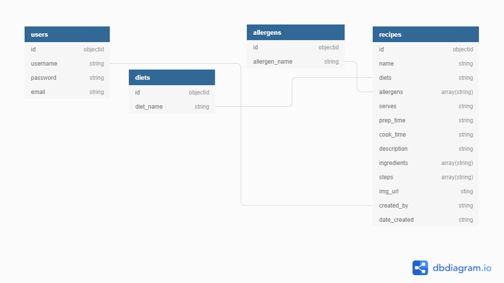

# Lazy Chef

Lazy Chef is a web app designed to save and share a users favorite recipes quickly and easily with other users. The deployed site can be viewed [here](herokuLink)

## Table of Contents
1. [UX](#ux)
    - [User Stories](#user-stories)
    - [Design](#design)
    - [Wireframes](#wireframes)
2. [Features](#features)
3. [Technologies Used](#technologies-used)
4. [Testing](#testing)

## UX
This application has been created using flask/python and MongoDB for the backend. The design is my own inspired by various other recipe applications.

### User Stories

User stories regarding the application in general:
    
- As a new user, I want to - 
    - easily understand the purpose of the site without further navigation.
    - to be able to easily navigate throughout the site.
    - be able to browse through recipes.
    - create a user profile.

- As a returning user, I want to be able to -
    - create and share recipes.
    - search the database of recipes.
    - see the ingredients included in each recipes

- As the application owner, I want to -
    - encourage people to sign up for an account.
    - I want to provide links to an external cooking equipment.

### Design
- This application is web based, using several html (jinja2) templates utilizing CRUD functionality (Create, Read, Update, and Delete) and a MongoDB Database.

- The styling is mostly based upon the Materializecss Framework 
    
- Font Families (Google Fonts):
  - [Permanent Marker](https://fonts.google.com/specimen/Permanent+Marker?query=en&preview.text=Lazy%20Chef%20&preview.text_type=custom#standard-styles)
  - [Montserrat](https://fonts.google.com/specimen/Montserrat?query=mont&preview.text=monserrat&preview.text_type=custom)

### Wireframes
Below are the wireframes used to design the app layout.

#### Home
- The sign up/registration will be hidden when a user is logged in.

#### Log in

#### Profile

#### Add Recipe

#### Recipe

### Wireframe changes 
 - Registration moved from home page to register page.

### Database
Below is a tabulated representation of the database that i have chosen to use in this application.

## Features
- A Navbar within the base template.
- A Search Bar on the home page which users can search by:
  - Recipe name
  - Diet
  - Description
  - ingredients
- Log In and Registration pages to allow new and existing users to log in.
- An easy to use Add/Edit Recipe forms to allow users to create and edit recipes 
- My Recipes page, where users can find edit and delete their recipes.
- Admin controls:
  - delete recipes from all recipes page
  - add, edit and delete diets

### Future Features
- Add user ratings and comments.
- Add email notifications.
- Add nutritional information.
- Auto fill search bars
- Delete modals/"are you sure" messages as currently when delete is clicked, the item is deleted without first prompting the user
- More admin controls:
    - Edit/delete users

## Technologies Used
### Languages:
  - [HTML5](https://en.wikipedia.org/wiki/HTML5)
    - This is the main mark-up language for the project
  - [CSS3](https://en.wikipedia.org/wiki/CSS)
    - Used for personalised styling over and above the Materialize styles
  - [JavaScript](https://en.wikipedia.org/wiki/JavaScript)
    - Used to animate and control aspects of the pages that move
  - [Python](https://www.python.org/)
    - Used to connect the frontend application to the backend database, and to control the navigation and publication of the application
  - [Jinja](https://jinja.palletsprojects.com/en/3.0.x/)
    - A templating language/engine used to simplify the page layouts and insert data from the database

### Libraries and Frameworks:
  - [Google Fonts](https://fonts.google.com/)
    - Used as the source for the font databases used in this site
  - [Font Awesome 5.15.3](https://fontawesome.com/)
    - Used as the source for the icons used
  - [Materialize](https://materializecss.com/)
    - The main CSS library used to style the pages and make it responsive
  - [Flask](https://flask.palletsprojects.com/en/2.0.x/)
    - A microframework used to provide the tools and libraries used to create the application
  - [Werkzeug](https://werkzeug.palletsprojects.com/en/2.0.x/)
    - A web-app library used to add security to user passwords

### Tools:
  - [Gitpod](https://www.gitpod.io/)
    - Gitpod is my preferred text editor, linked with GitHub Desktop in order to push the code to GitHub
  - [Git](https://git-scm.com/)
    - Used for version control
  - [GitHub](https://github.com/)
    - Used to store the project files
  - [Figma](https://www.figma.com/)
    - A wireframe program used to create the mock-ups

## Testing

