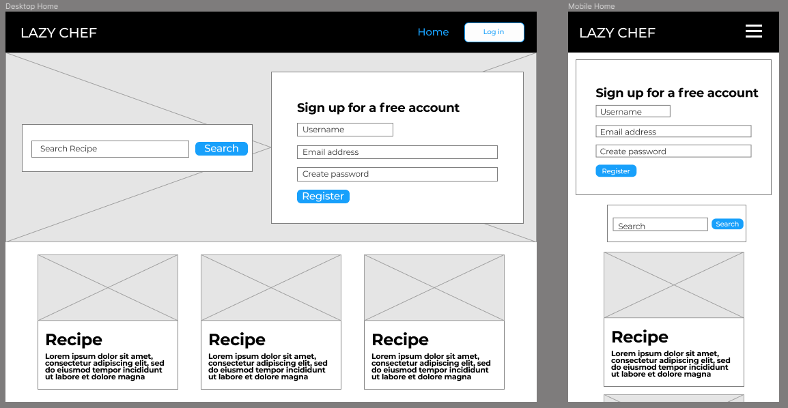
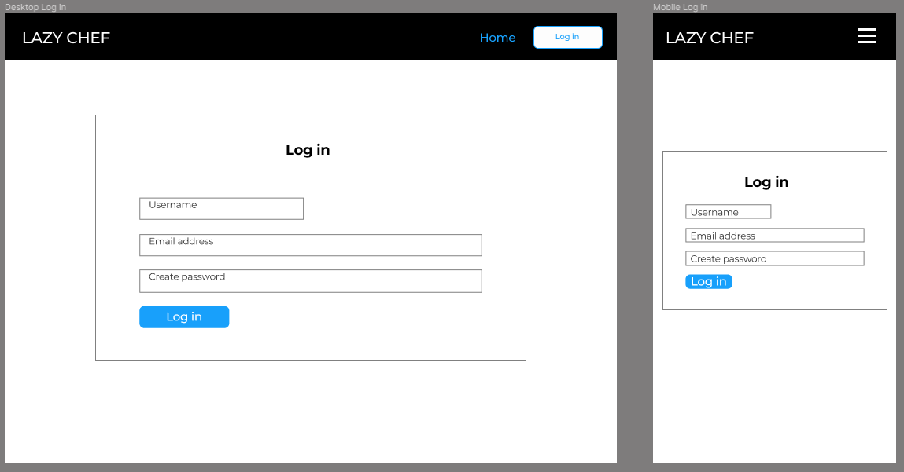
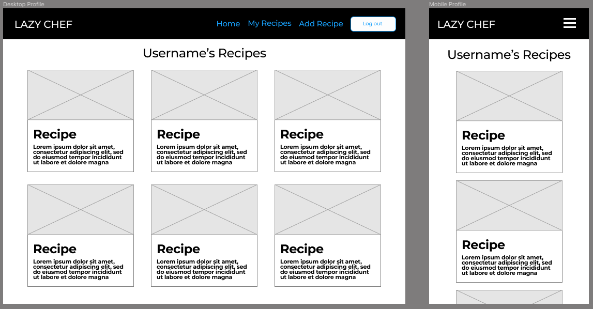
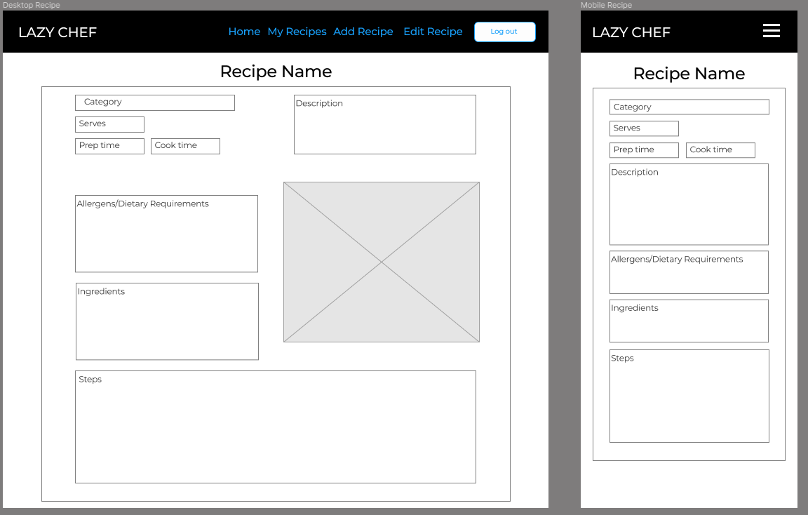

# Lazy Chef

Lazy Chef is a web app designed to save and share a users favorite recipes quickly and easily with other users. The deployed site can be viewed [here](herokuLink)

## Table of Contents
1. [UX](#ux)
    - [User Stories](#user-stories)
    - [Design](#design)
    - [Wireframes](#wireframes)
2. 
3. 

## UX
This application has been created using flask/python and MongoDB for the backend. The design is my own inspired by various other recipe applications.

### User Stories

User stories regarding the application in general:
    
- As a new user, I want to - 
    - easily understand the purpose of the site without further navigation.
    - to be able to easily navigate throughout the site.
    - be able to browse through recipes.
    - create a user profile.

- As a returning user, I want to be able to -
    - create and share recipes.
    - search the database of recipes.
    - see the ingredients included in each recipes

- As the application owner, I want to -
    - encourage people to sign up for an account.
    - I want to provide links to an external cooking equipment.

### Design
- The styling is mostly based upon the Materializecss Framework 
    
- Font Family
    
- Color Scheme

### Wireframes
Below are the wireframes used to design the app layout.

#### Home
- The sign up/registration will be hidden when a user is logged in.

#### Log in

#### Profile

#### Add Recipe

#### Recipe

### Wireframe changes 
 - Registration moved from home page to register page.
