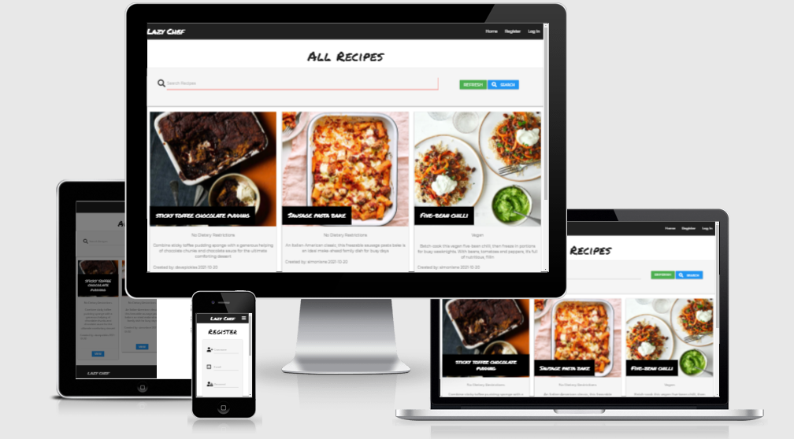
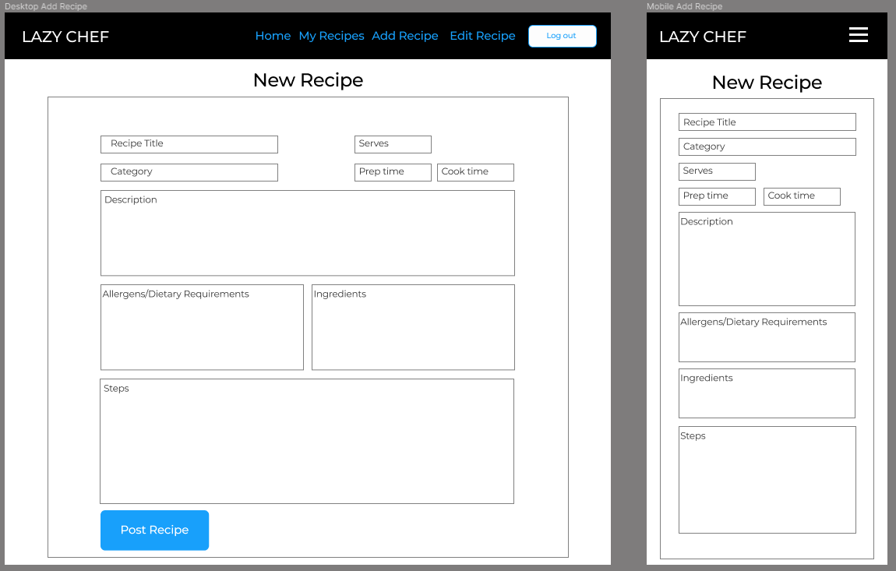
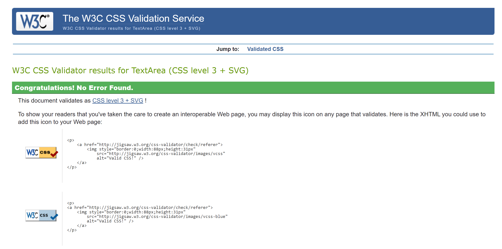
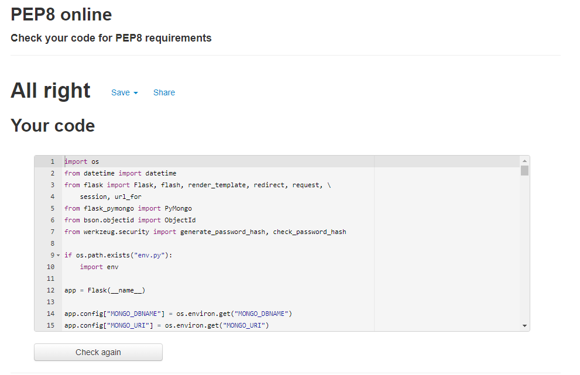

# Lazy Chef

Lazy Chef is a web app designed to save and share a users favorite recipes quickly and easily with other users. The deployed site can be viewed [here](http://lazy-chef-app.herokuapp.com/get_recipes)

## Table of Contents
1. [UX](#ux)
    - [User Stories](#user-stories)
    - [Design](#design)
    - [Wireframes](#wireframes)
2. [Features](#features)
3. [Technologies Used](#technologies-used)
4. [Testing](#testing)
5. [Deployment](#deployment)
6. [Credits](#credits)
    - [Content](#content)
    - [Acknowledgements](#acknowledgements)

## UX
This application has been created using flask/python and MongoDB for the backend. The design is my own inspired by various other recipe applications.

### User Stories

User stories regarding the application in general:
    
- As a new user, I want to - 
    - easily understand the purpose of the site without further navigation.
    - to be able to easily navigate throughout the site.
    - be able to browse through recipes.
    - create a user profile.

- As a returning user, I want to be able to -
    - create and share recipes.
    - search the database of recipes.
    - see the ingredients included in each recipes

- As the application owner, I want to -
    - encourage people to sign up for an account.
    - I want to provide links to an external cooking equipment.

### Design
- This application is web based, using several html (jinja2) templates utilizing CRUD functionality (Create, Read, Update, and Delete) and a MongoDB Database.

- The styling is mostly based upon the Materializecss Framework 
    
- Font Families (Google Fonts):
  - [Permanent Marker](https://fonts.google.com/specimen/Permanent+Marker?query=en&preview.text=Lazy%20Chef%20&preview.text_type=custom#standard-styles)
  - [Montserrat](https://fonts.google.com/specimen/Montserrat?query=mont&preview.text=monserrat&preview.text_type=custom)

### Wireframes
Below are the wireframes used to design the app layout.

#### Home
- The sign up/registration will be hidden when a user is logged in.

#### Log in

#### Profile

#### Add Recipe

#### Recipe

### Wireframe changes 
 - Registration moved from home page to register page.

### Database
Below is a tabulated representation of the database that i have chosen to use in this application.

## Features
- A Navbar within the base template.
- A Search Bar on the home page which users can search by:
  - Recipe name
  - Diet
  - Description
  - ingredients
- Log In and Registration pages to allow new and existing users to log in.
- An easy to use Add/Edit Recipe forms to allow users to create and edit recipes 
- My Recipes page, where users can find edit and delete their recipes.
- Admin controls:
  - delete recipes from all recipes page
  - add, edit and delete diets

### Future Features
- Add user ratings and comments.
- Add email notifications.
- Add nutritional information.
- Auto fill search bars
- Delete modals/"are you sure" messages as currently when delete is clicked, the item is deleted without first prompting the user
- More admin controls:
    - Edit/delete users

## Technologies Used
### Languages:
  - [HTML5](https://en.wikipedia.org/wiki/HTML5)
    - This is the main mark-up language for the project
  - [CSS3](https://en.wikipedia.org/wiki/CSS)
    - Used for personalised styling over and above the Materialize styles
  - [JavaScript](https://en.wikipedia.org/wiki/JavaScript)
    - Used to animate and control aspects of the pages that move
  - [Python](https://www.python.org/)
    - Used to connect the frontend application to the backend database, and to control the navigation and publication of the application
  - [Jinja](https://jinja.palletsprojects.com/en/3.0.x/)
    - A templating language/engine used to simplify the page layouts and insert data from the database

### Libraries and Frameworks:
  - [Google Fonts](https://fonts.google.com/)
    - Used as the source for the font databases used in this site
  - [Font Awesome 5.15.3](https://fontawesome.com/)
    - Used as the source for the icons used
  - [Materialize](https://materializecss.com/)
    - The main CSS library used to style the pages and make it responsive
  - [Flask](https://flask.palletsprojects.com/en/2.0.x/)
    - A microframework used to provide the tools and libraries used to create the application
  - [Werkzeug](https://werkzeug.palletsprojects.com/en/2.0.x/)
    - A web-app library used to add security to user passwords

### Tools:
  - [Gitpod](https://www.gitpod.io/)
    - Gitpod is my preferred text editor, linked with GitHub Desktop in order to push the code to GitHub
  - [Git](https://git-scm.com/)
    - Used for version control
  - [GitHub](https://github.com/)
    - Used to store the project files
  - [Figma](https://www.figma.com/)
    - A wireframe program used to create the mock-ups

## Testing
### HTML
The HTML code was passed through the [W3C Markup Validation Service](https://validator.w3.org/).

Any errors that remain are due to the sections of Jinja language that are not able to pass through an HTML validator.

### CSS
The CSS file was passed through the [W3C CSS Validation Service](https://jigsaw.w3.org/css-validator/).

### JavaScript
The JavaScript file was copied into [JSLint](https://www.jslint.com/) for error checking. No errors were found.

### Python
The python code was copied into [PEP8 online](http://pep8online.com/) for error checking. The errors found were minor and related to spacing around operators and indentation surrounding continuation lines. This was subsequently corrected and re-tested:

### Objective Testing
### Nav
- All nav links functioning correctly, returning the correct templates.
- Mobile side nav displaying and functioning correctly, returning the correct templates.
- When not logged in nav displays the following links:
  - Home
  - Register
  - Log In
- When logged in as user nav displays the following links:
  - Home
  - My Recipes
  - New Recipe
  - Log out
- When logged in as Admin nav displays the following links:
  - Home
  - My Recipes
  - New Recipe
  - Diets
  - Log out

### Footer
- All footer links functioning correctly

### Home
#### Search
- Search bar, searches Name, Description, Ingredients, Diet from the recipes collection and displays the correct recipes.
- When no recipes match search "No Recipes Found" is displayed.
- Search button functions correctly.
- Refresh button refreshes the page and displays all recipes.

#### Recipe Cards
- All recipes are displayed on individual cards
- Recipe cards display the following:
 - Image URL
 - Name
 - Description
 - Diets
 - Created by
 - Date created
 - View recipe button
 - Delete recipe button (When logged in as admin)
- View recipe button redirects user to view recipes template.
- Delete recipes button deletes recipe.

### Register
- Register form functions correctly.
- Form validation functions correctly.
- Form input tooltips function correctly.
- If user name already exists flash message reads "Username Already Exists".
- If user email already exists flash message reads "Email already used!".
- Register button functions correctly.

### Log In
- Log in form functions correctly.
- Form validation functions correctly.
- Form input tooltips function correctly.
- If username or password is incorrect flash message reads "Incorrect Username and/or Password"
- Log in button functions correctly (posts form to db).
  (redirects user to my recipes template and displays flash message "Welcome Username").
- Register account button redirects user to Register template.

### Log out
- Log out nav button logs user out of session

### My Recipes
- My recipes displays all users recipes they have created.
- If no recipes message displays "It looks like you don't have any recipes yet!" with add recipe button.
  (add recipe button functions correctly and redirects user to add recipes template)
- My Recipe cards display the following:
 - Image URL
 - Name
 - Description
 - Diets
 - View recipe button
 - Edit recipe button
 - Delete recipe button
- View recipe button redirects user to view recipes template.
- Edit recipe button redirects user to view recipes template.
- Delete recipe button deletes recipe. (flash message "Recipe Successfully Deleted").
  - Delete recipe can only be accessed by either the recipe created by or "admin"

### New Recipes
- If a user is not logged in user is redirected to log in template.
- Edit recipe form displays the following inputs
 - Recipe name
 - Serves
 - Prep time
 - Cook time
 - Diet (select, gets correct data from db)
 - Allergens (multiple select, gets correct data from db)
 - Description
 - Ingredients (ingredients separated by ">", individual ingredients listed in db array)
 - Steps (steps separated by ">", individual steps listed in db array)
 - Image Url (pre filled with generic recipe image link)
- Form validation functioning correctly.
- Post Recipe button functions correctly (posts form to db, flash message "Recipe Successfully Posted", redirects user to my recipes) 

### Edit Recipe
- Form displays the same inputs as new recipe.
- Form validation functioning correctly.
- Form pre fills all fields (except Allergens) for correct recipe.
 - ">" Are added back in to the Ingredients and Steps inputs.
- Update Recipe button functions correctly (posts form to db, flash message "Recipe updated" redirects user to my recipes).
- Cancel button function correctly (redirects user to all recipes).

### Diets (admin)
- All diets are displayed.
- Diet cards display the following:
 - Diet name
 - Edit button
 - Delete Button
- Add diet button redirects user to add diets template.
 - Add diet form functions correctly (tooltips, validation).
 - Add diet form button functions correctly (posts form to db, flash message "New Diet Added").
- Edit button redirects user to edit diets template.
 - Edit diet form functions correctly (tooltips, validation).
 - Edit diet form button functions correctly (posts form to db, flash message "Diet Successfully Updated").
 - Cancel button redirects user to diets template.
- Delete diet button deletes diet (flash message "Diet Successfully Deleted").

### Error Pages
- Error page 400 functions and displays correctly
- Error page 404 functions and displays correctly
- Error page 500 functions and displays correctly

### Responsiveness
- My app was made using materializecss which ensured my web ap is responsive, All pages are displayed correctly on all screen sizes without compromising the content of the page.

#### Test Users

Username: admin         Password: adm1n
Username: davepickles   Password: Password
Username: simonlane     Password: Password

## Deployment
### Heroku
Deployment for this project is via [Heroku](https://www.heroku.com).
1. Create a requirements.txt file by typing pip3 freeze --local > requirements.txt in your repository terminal
2. Create a Procfile so that Heroku knows how to run the app. Do this by typing echo web: python app.py into your repositories terminal
3. Make sure these files have been pushed to the GitHub repository and then navigate to [Heroku](https://www.heroku.com)
4. Log in and select 'new' in the top right, name your app and choose a region that is closest to you. The app name must be unique.
5. On the dashboard for your app, select the 'Deploy' tab and under deployment method, select GitHub (the easiest option if your repository is in GitHub)
6. Enter the repository name underneath that and hit search. select the repository by clicking 'Connect'
7. You can either select Automatic or Manual deployment depending on your method. This project has been deployed with the manual method. Remember that if you choose manual, then every time the main/master branch is changed, you will need to re-deploy the app.
8. Next, go to the 'Settings' tab and select 'Reveal Config Vars'
9. Here you need to add several KEY: VALUE pairs for the app to run. They are
  - I.P: 0.0.0.0
  - PORT: 5000
  - MONGO_DBNAME: *database name*
  - MONGO_URI: *MongoDB URI, taken from the connections section of the database*
  - SECRET_KEY: *secret key of your choice*
10. Once these KEY: VALUE pairs have been added, the app will be reachable from the [Heroku](https://www.heroku.com) portal

### Forking the Repository
If you would like to view/change the code for the project then you can copy this repository to your GitHub account by forking it. You will then be able to do this without affecting the original repository:
1. From the repository home page,  click the 'fork' button (just below your picture with the dropdown menu)
2. You should now have a copy of the repository on your account

### Making a Local Clone
1. From the repository home page, select the 'code' tab (next to the green 'Gitpod' button)
2. To clone the repository using HTTPS, under "Clone with HTTPS", copy the link.
3. Open Git Bash
4. Change the current working directory to the location where you want the cloned directory to be made.
5. Type 'git clone', and then paste the URL you copied in Step 2.
6. Press Enter. Your local clone will be created.
7. Alternatively, you can use 'Open with GitHub Desktop' and follow the instructions, or just download the ZIP file containing the code files

Click [Here](https://docs.github.com/en/github/creating-cloning-and-archiving-repositories/cloning-a-repository-from-github/cloning-a-repository#cloning-a-repository-to-github-desktop) to view the GitHub documentation on deployment, or [Here](https://devcenter.heroku.com/)for the Heroku documentation for further help and advice.

## Credits

### Content
  - All code was written by myself (with one exception; see below), with inspiration taken from the Code Institute walkthrough projects
   - Form Validation Javascript

### Acknowledgements
  - Thanks to my mentor and tutors for help!
  - [Stack Overflow](https://stackoverflow.com/)
  - [Code Institute](https://codeinstitute.net/)